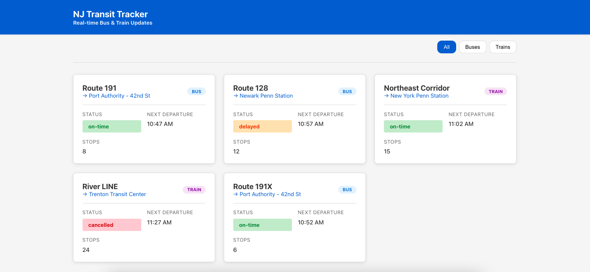
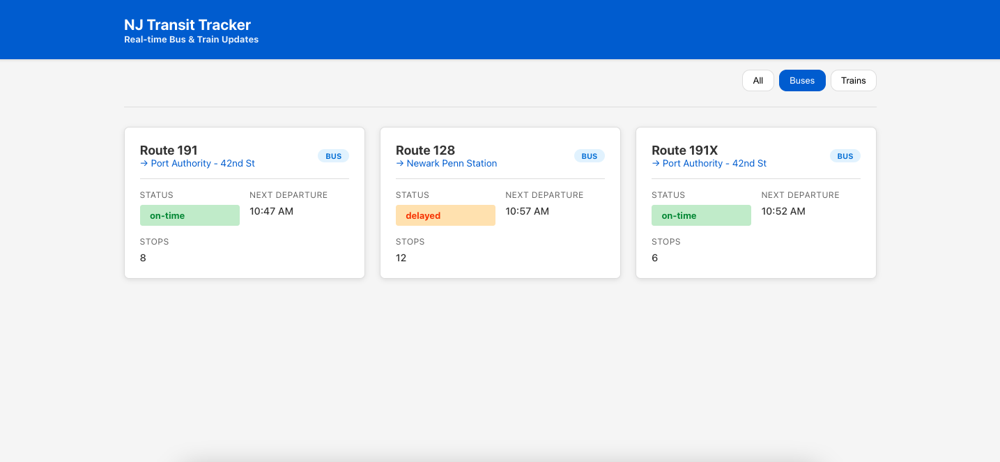
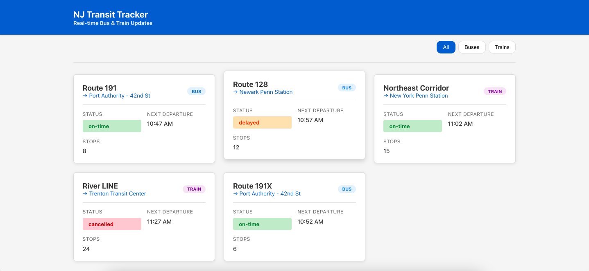

# NJ Transit Tracker

A portfolio project showcasing UI/UX skills with a Lit web components app for tracking NJ transit buses and trains. Features real-time route status, a clean, responsive design, and a routes-first experience.

## Features

- 🚌 **Route Tracking**: Browse active bus and train routes with real-time status
- 🎯 **Responsive Design**: Mobile-friendly UI built with modern CSS Grid and Flexbox
- ⚡ **Lit Web Components**: Reusable, performant components built with Lit
- 🎨 **Clean UI/UX**: Professional design showcasing portfolio-grade UI skills

## Demo

<video controls width="100%" poster="assets/Screen Recording 2026-07-16 at 11.13.28 AM.mov">
  <source src="assets/Screen Recording 2026-07-16 at 11.13.28 AM.mov" type="video/quicktime">
  Your browser does not support the video tag.
</video>

### Screenshots







## Project Structure

```
nj-transit-tracker/
├── src/
│   ├── components/           # Reusable UI components
│   │   ├── header/          # App header component
│   │   └── cards/           # Reusable card components
│   ├── pages/               # Page-level components
│   │   └── routes-page.ts
│   ├── models/              # TypeScript interfaces/types
│   │   └── transit.ts
│   ├── data/                # Mock data
│   │   └── mock-data.ts
│   ├── main.ts              # Entry point
│   ├── app.ts               # Root component
│   └── style.css            # Global styles
├── index.html               # HTML entry point
├── package.json             # Dependencies & scripts
├── tsconfig.json            # TypeScript config
├── vite.config.ts           # Vite config
└── README.md               # This file
```

## Getting Started

### Prerequisites

- Node.js (v18+)
- npm or yarn

### Installation

1. Install dependencies:

```bash
npm install
```

2. Start the development server:

```bash
npm run dev
```

The app will open automatically at `http://localhost:5173`

### Available Scripts

- `npm run dev` - Start development server
- `npm run build` - Build for production
- `npm run preview` - Preview production build
- `npm run lint` - Run ESLint
- `npm run type-check` - Run TypeScript type checking

## Components

### Header (`app-header`)

Displays the app title and branding with logo and tagline.

### Route Card (`route-card`)

Displays individual transit route information including:

- Route name and type (bus/train)
- Current status (on-time, delayed, cancelled)
- Next departure time
- Number of stops
- Destination

## Pages

### Routes Page (`routes-page`)

Browse all transit routes with filtering by type (bus/train). Cards are displayed in a responsive grid.

## Mock Data

The app uses dummy data stored in `src/data/mock-data.ts`. This includes:

- 5 sample routes (bus and train)
- 3 sample vehicle locations

To add more routes, edit the mock data file.

## Technologies

- **Lit** - Lightweight web components framework
- **TypeScript** - Type-safe JavaScript
- **Vite** - Fast build tool and dev server
- **CSS3** - Modern styling with CSS variables and Grid/Flexbox

## Browser Support

Modern browsers with Web Components support (Chrome, Firefox, Safari, Edge)

## Future Enhancements

- [ ] Real API integration with NJ Transit data
- [ ] Live vehicle tracking map
- [ ] User preferences/favorites
- [ ] Push notifications for alerts
- [ ] Route planning and directions
- [ ] Schedule details and timetables

## License

MIT
